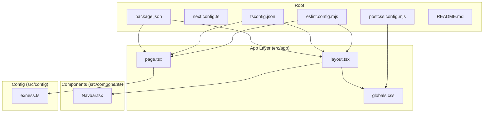
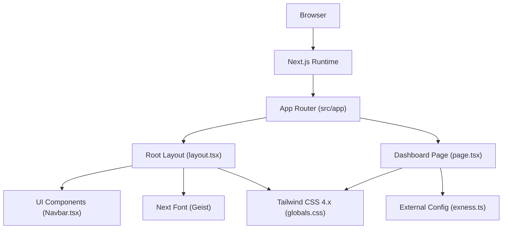
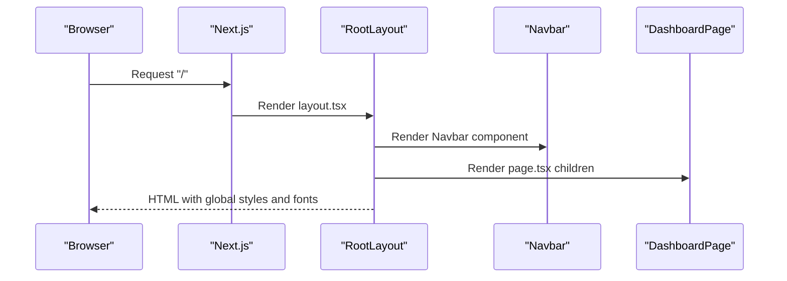
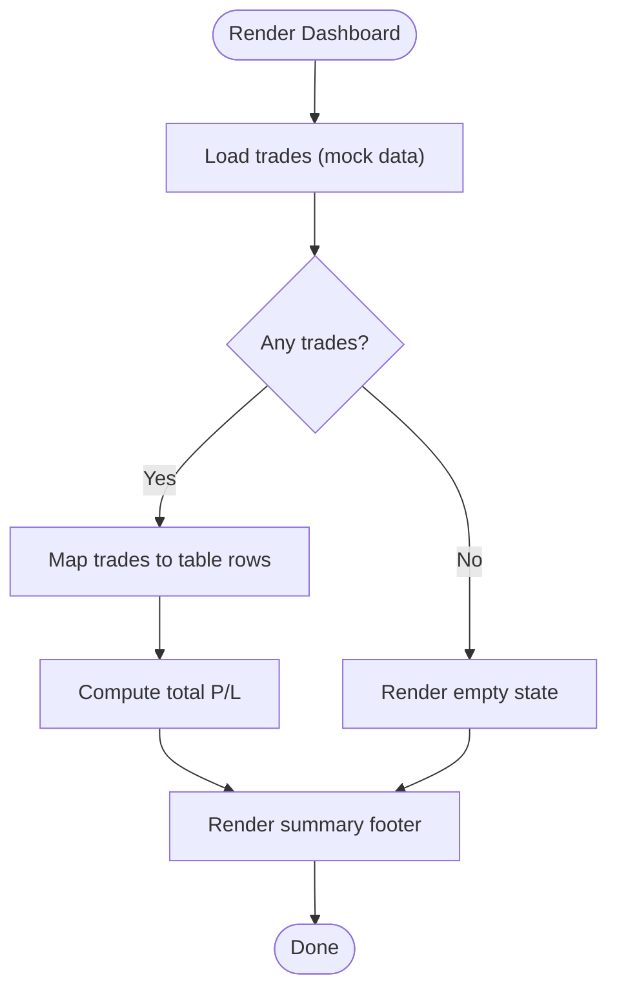
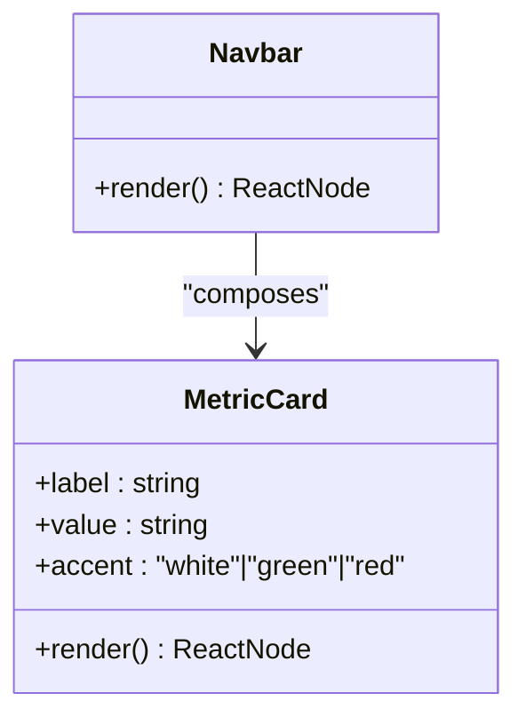
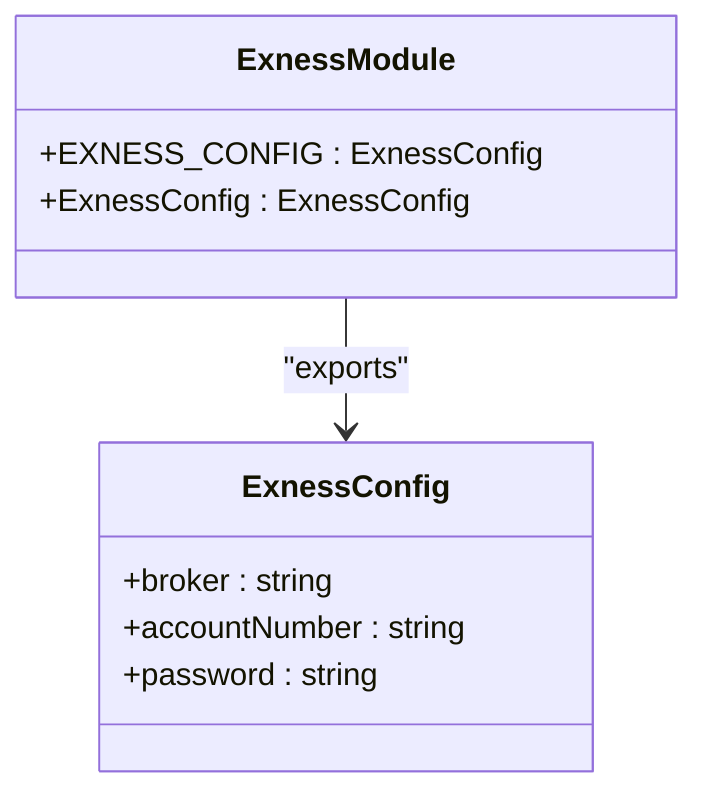
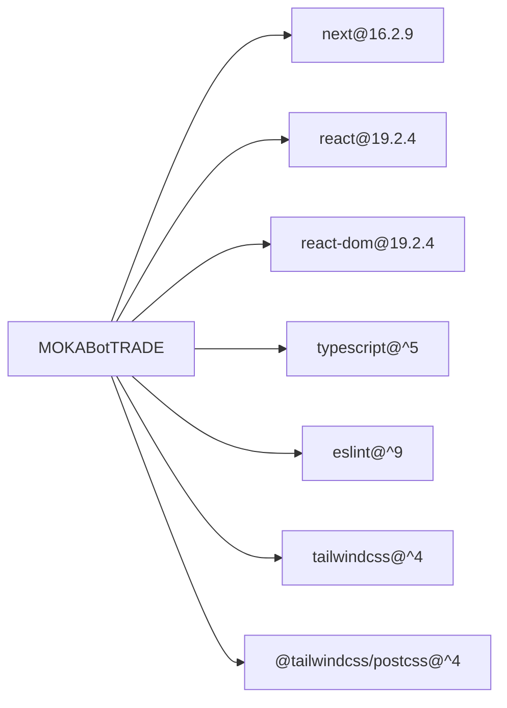

# Architecture & Technology Stack

<cite>
**Referenced Files in This Document**
- [package.json](file://package.json)
- [next.config.ts](file://next.config.ts)
- [tsconfig.json](file://tsconfig.json)
- [eslint.config.mjs](file://eslint.config.mjs)
- [postcss.config.mjs](file://postcss.config.mjs)
- [src/app/layout.tsx](file://src/app/layout.tsx)
- [src/app/page.tsx](file://src/app/page.tsx)
- [src/app/globals.css](file://src/app/globals.css)
- [src/components/Navbar.tsx](file://src/components/Navbar.tsx)
- [src/config/exness.ts](file://src/config/exness.ts)
- [README.md](file://README.md)
</cite>

## Table of Contents
1. [Introduction](#introduction)
2. [Project Structure](#project-structure)
3. [Core Components](#core-components)
4. [Architecture Overview](#architecture-overview)
5. [Detailed Component Analysis](#detailed-component-analysis)
6. [Dependency Analysis](#dependency-analysis)
7. [Performance Considerations](#performance-considerations)
8. [Troubleshooting Guide](#troubleshooting-guide)
9. [Conclusion](#conclusion)

## Introduction
This document describes the architecture and technology stack of MOKABotTRADE, a frontend-only Next.js 16.2.9 application that renders a live trading dashboard for Exness MT5. The system follows modern React patterns with TypeScript, uses Tailwind CSS 4.x for utility-first styling, and integrates ESLint and PostCSS for code quality and styling pipeline. It emphasizes component-based design, configuration modules for external services, and separation of concerns between UI and data configuration.

## Project Structure
The repository is organized around Next.js App Router conventions with a minimal, focused structure:
- Public assets under a dedicated folder
- Application entry points under src/app (layout, page)
- Shared UI components under src/components
- External service configuration under src/config
- Build and tooling configurations at the repository root

**Diagram sources**
- [package.json:1-27](file://package.json#L1-L27)
- [next.config.ts:1-8](file://next.config.ts#L1-L8)
- [tsconfig.json:1-35](file://tsconfig.json#L1-L35)
- [eslint.config.mjs:1-19](file://eslint.config.mjs#L1-L19)
- [postcss.config.mjs:1-8](file://postcss.config.mjs#L1-L8)
- [src/app/layout.tsx:1-38](file://src/app/layout.tsx#L1-L38)
- [src/app/page.tsx:1-188](file://src/app/page.tsx#L1-L188)
- [src/app/globals.css:1-31](file://src/app/globals.css#L1-L31)
- [src/components/Navbar.tsx:1-100](file://src/components/Navbar.tsx#L1-L100)
- [src/config/exness.ts:1-17](file://src/config/exness.ts#L1-L17)

**Section sources**
- [package.json:1-27](file://package.json#L1-L27)
- [README.md:1-37](file://README.md#L1-L37)

## Core Components
- Root layout and metadata: Defines the HTML shell, fonts, and global styles, and composes the Navbar and page content.
- Dashboard page: Renders a live trading table with mock data and helper utilities for formatting and styling.
- Navbar: A client-side component displaying trading metrics and bot status with responsive mobile layout.
- Configuration module: Encapsulates Exness MT5 account credentials and exposes a strongly typed interface.

Key architectural patterns:
- Component-based design: UI is composed from small, reusable components.
- Configuration module pattern: External service credentials are centralized and strongly typed.
- Separation of concerns: UI components focus on rendering, while configuration modules encapsulate external service details.

**Section sources**
- [src/app/layout.tsx:1-38](file://src/app/layout.tsx#L1-L38)
- [src/app/page.tsx:1-188](file://src/app/page.tsx#L1-L188)
- [src/components/Navbar.tsx:1-100](file://src/components/Navbar.tsx#L1-L100)
- [src/config/exness.ts:1-17](file://src/config/exness.ts#L1-L17)

## Architecture Overview
The system is a frontend-only Next.js application leveraging:
- Next.js App Router for file-based routing and layout composition
- React 19 for component model and client directives
- TypeScript for type safety across UI and configuration layers
- Tailwind CSS 4.x for utility-first styling and responsive design
- ESLint for code quality and Next.js best practices
- PostCSS with Tailwind plugin for CSS processing

**Diagram sources**
- [src/app/layout.tsx:1-38](file://src/app/layout.tsx#L1-L38)
- [src/app/page.tsx:1-188](file://src/app/page.tsx#L1-L188)
- [src/components/Navbar.tsx:1-100](file://src/components/Navbar.tsx#L1-L100)
- [src/config/exness.ts:1-17](file://src/config/exness.ts#L1-L17)
- [src/app/globals.css:1-31](file://src/app/globals.css#L1-L31)

## Detailed Component Analysis

### Root Layout and Global Styles
- Provides the HTML document shell, metadata, and global font loading via Next Font.
- Composes the Navbar and page content area with Tailwind utility classes.
- Imports global CSS that sets theme tokens and animations.

**Diagram sources**
- [src/app/layout.tsx:1-38](file://src/app/layout.tsx#L1-L38)
- [src/components/Navbar.tsx:1-100](file://src/components/Navbar.tsx#L1-L100)
- [src/app/page.tsx:1-188](file://src/app/page.tsx#L1-L188)

**Section sources**
- [src/app/layout.tsx:1-38](file://src/app/layout.tsx#L1-L38)
- [src/app/globals.css:1-31](file://src/app/globals.css#L1-L31)

### Dashboard Page and Data Presentation
- Declares a strongly typed trade interface and helper functions for formatting profit/loss and badges.
- Renders a responsive table with column headers and rows, including a fallback when no trades exist.
- Computes total profit/loss and displays last sync status.

**Diagram sources**
- [src/app/page.tsx:1-188](file://src/app/page.tsx#L1-L188)

**Section sources**
- [src/app/page.tsx:1-188](file://src/app/page.tsx#L1-L188)

### Navbar Component
- Client directive enables client-side interactivity.
- Uses a metric card component to render trading metrics with color-coded accents.
- Responsive design with a hidden desktop bar and a mobile metrics row.

**Diagram sources**
- [src/components/Navbar.tsx:1-100](file://src/components/Navbar.tsx#L1-L100)

**Section sources**
- [src/components/Navbar.tsx:1-100](file://src/components/Navbar.tsx#L1-L100)

### Configuration Module Pattern (Exness)
- Centralizes Exness MT5 credentials and exports a strongly typed configuration object.
- Encourages secure handling by keeping sensitive data in a separate module.

**Diagram sources**
- [src/config/exness.ts:1-17](file://src/config/exness.ts#L1-L17)

**Section sources**
- [src/config/exness.ts:1-17](file://src/config/exness.ts#L1-L17)

## Dependency Analysis
Runtime and build-time dependencies are declared in the package manifest. The application relies on Next.js 16.2.9, React 19, and Tailwind CSS 4.x. Development tooling includes TypeScript, ESLint, and PostCSS with Tailwind plugin.

**Diagram sources**
- [package.json:11-25](file://package.json#L11-L25)

**Section sources**
- [package.json:1-27](file://package.json#L1-L27)

## Performance Considerations
- Next.js App Router provides automatic code splitting and route-level caching.
- Next Font optimizes font loading with font-display and variable fonts.
- Tailwind CSS 4.x generates utility classes at build time, minimizing runtime overhead.
- Strict TypeScript configuration improves type safety and reduces runtime errors.
- ESLint enforces performance-friendly patterns and Next.js best practices.

[No sources needed since this section provides general guidance]

## Troubleshooting Guide
- Build failures: Verify TypeScript strict mode and JSX configuration in the TypeScript compiler options.
- Styling issues: Confirm Tailwind plugin is enabled in PostCSS and global CSS imports are present.
- Lint errors: Review ESLint configuration and ensure Next.js core-web-vitals and TypeScript presets are applied.
- Deployment: Follow Next.js deployment guidance for Vercel or self-hosted environments.

**Section sources**
- [tsconfig.json:1-35](file://tsconfig.json#L1-L35)
- [eslint.config.mjs:1-19](file://eslint.config.mjs#L1-L19)
- [postcss.config.mjs:1-8](file://postcss.config.mjs#L1-L8)
- [README.md:32-37](file://README.md#L32-L37)

## Conclusion
MOKABotTRADE employs a clean, component-based architecture with strong TypeScript typing and utility-first styling via Tailwind CSS 4.x. The Next.js 16.2.9 App Router enables a file-based routing system and layout composition that cleanly separates UI concerns from configuration. The project’s frontend-only nature simplifies deployment and scaling, while the configuration module pattern ensures secure and maintainable external service integration.