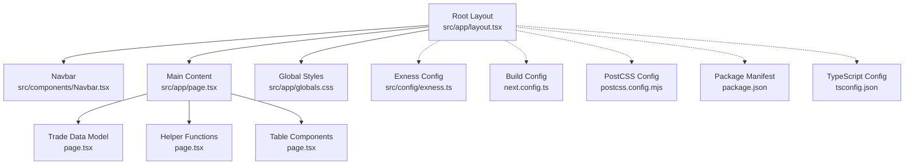
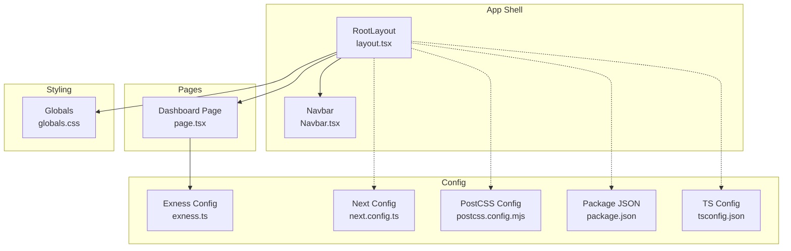
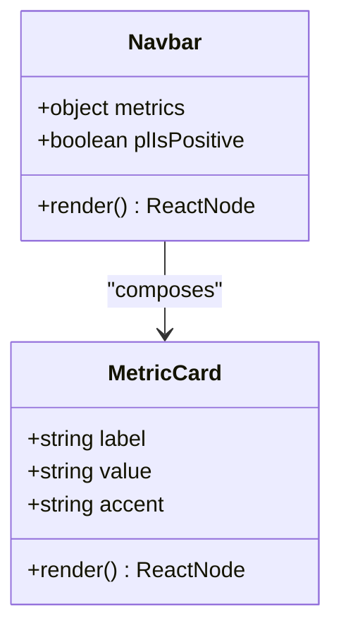
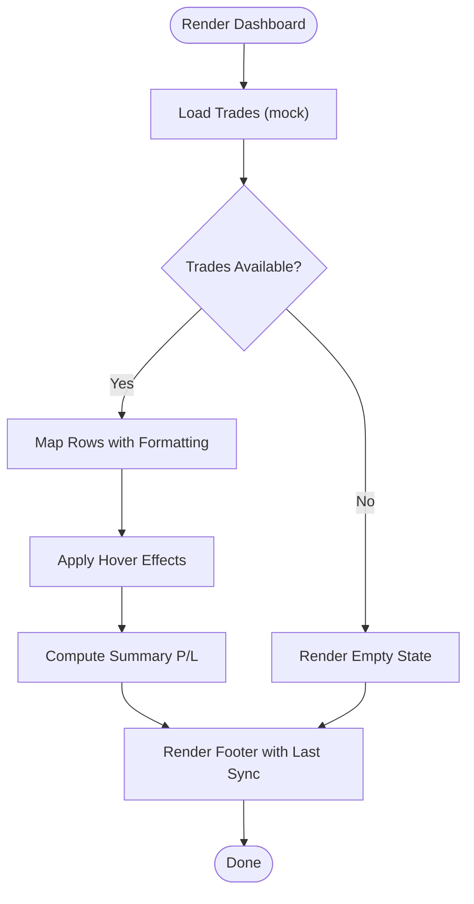
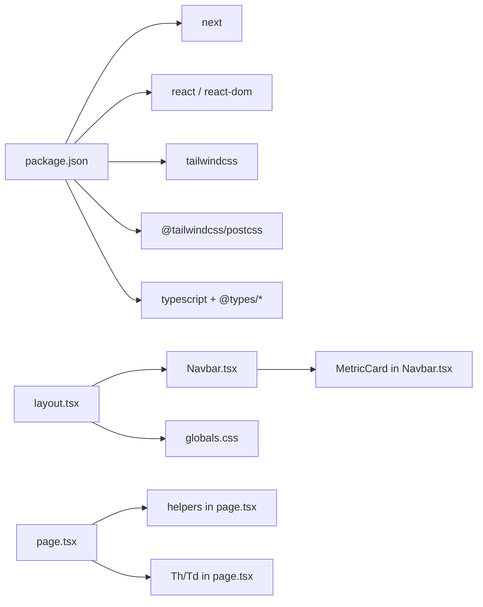
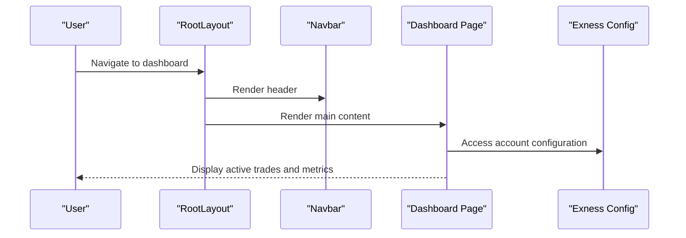

# Components & UI

<cite>
**Referenced Files in This Document**
- [src/app/page.tsx](file://src/app/page.tsx)
- [src/components/Navbar.tsx](file://src/components/Navbar.tsx)
- [src/app/layout.tsx](file://src/app/layout.tsx)
- [src/app/globals.css](file://src/app/globals.css)
- [src/config/exness.ts](file://src/config/exness.ts)
- [package.json](file://package.json)
- [next.config.ts](file://next.config.ts)
- [postcss.config.mjs](file://postcss.config.mjs)
- [tsconfig.json](file://tsconfig.json)
- [README.md](file://README.md)
</cite>

## Table of Contents
1. [Introduction](#introduction)
2. [Project Structure](#project-structure)
3. [Core Components](#core-components)
4. [Architecture Overview](#architecture-overview)
5. [Detailed Component Analysis](#detailed-component-analysis)
6. [Dependency Analysis](#dependency-analysis)
7. [Performance Considerations](#performance-considerations)
8. [Troubleshooting Guide](#troubleshooting-guide)
9. [Conclusion](#conclusion)
10. [Appendices](#appendices)

## Introduction
This document describes the component architecture and user interface implementation of MOKABotTRADE. It focuses on the Navbar component as the primary navigation element, the main dashboard page (page.tsx) that displays active trades, the layout component responsible for application-wide structure, and the global CSS implementation for styling and theming. It also documents component composition patterns, prop passing, state management approaches, reusability strategies, responsive design, and the dark theme implementation using Tailwind CSS and custom styles.

## Project Structure
The application follows a Next.js App Router structure with a small set of focused UI components:
- Application shell and routing: src/app/layout.tsx and src/app/page.tsx
- Global styles and fonts: src/app/globals.css
- Navigation bar: src/components/Navbar.tsx
- Configuration for Exness MT5 integration: src/config/exness.ts
- Build and tooling configuration: package.json, next.config.ts, postcss.config.mjs, tsconfig.json
- Project metadata and getting started guide: README.md

**Diagram sources**
- [src/app/layout.tsx:21-37](file://src/app/layout.tsx#L21-L37)
- [src/components/Navbar.tsx:30-99](file://src/components/Navbar.tsx#L30-L99)
- [src/app/page.tsx:95-187](file://src/app/page.tsx#L95-L187)
- [src/app/globals.css:1-31](file://src/app/globals.css#L1-L31)
- [src/config/exness.ts:5-14](file://src/config/exness.ts#L5-L14)
- [next.config.ts:3-5](file://next.config.ts#L3-L5)
- [postcss.config.mjs:1-7](file://postcss.config.mjs#L1-L7)
- [package.json:11-25](file://package.json#L11-L25)
- [tsconfig.json:21-23](file://tsconfig.json#L21-L23)

**Section sources**
- [src/app/layout.tsx:21-37](file://src/app/layout.tsx#L21-L37)
- [src/app/page.tsx:95-187](file://src/app/page.tsx#L95-L187)
- [src/components/Navbar.tsx:30-99](file://src/components/Navbar.tsx#L30-L99)
- [src/app/globals.css:1-31](file://src/app/globals.css#L1-L31)
- [src/config/exness.ts:5-14](file://src/config/exness.ts#L5-L14)
- [next.config.ts:3-5](file://next.config.ts#L3-L5)
- [postcss.config.mjs:1-7](file://postcss.config.mjs#L1-L7)
- [package.json:11-25](file://package.json#L11-L25)
- [tsconfig.json:21-23](file://tsconfig.json#L21-L23)

## Core Components
- Navbar: Provides the application header with branding, trading metrics, and bot status. It is a client component and integrates responsive design for desktop and mobile views.
- Dashboard Page: Renders the Active Trades table with mock data, formatting helpers, and summary calculations. It demonstrates reusable table cell components and conditional rendering.
- Layout: Wraps the application with fonts, global styles, and the Navbar, delegating content rendering to child routes.
- Global CSS: Defines dark theme tokens, font variables, and animations for the “LIVE” indicator.

Key implementation highlights:
- Prop-based composition: Navbar accepts metric props and exposes a MetricCard subcomponent for reuse.
- Helper functions: Dashboard page defines formatting and color helpers for profit/loss and badge styling.
- Reusable UI primitives: Dashboard page introduces Th and Td components for consistent table rendering.
- Responsive design: Navbar and Dashboard adapt to screen sizes using Tailwind utilities.

**Section sources**
- [src/components/Navbar.tsx:30-99](file://src/components/Navbar.tsx#L30-L99)
- [src/app/page.tsx:95-187](file://src/app/page.tsx#L95-L187)
- [src/app/layout.tsx:21-37](file://src/app/layout.tsx#L21-L37)
- [src/app/globals.css:1-31](file://src/app/globals.css#L1-L31)

## Architecture Overview
The application uses a minimal, layered architecture:
- Root layout composes the Navbar and renders page content.
- The page component encapsulates dashboard logic and UI.
- Global CSS sets base theme and typography.
- Configuration files define build and runtime settings.

**Diagram sources**
- [src/app/layout.tsx:21-37](file://src/app/layout.tsx#L21-L37)
- [src/components/Navbar.tsx:30-99](file://src/components/Navbar.tsx#L30-L99)
- [src/app/page.tsx:95-187](file://src/app/page.tsx#L95-L187)
- [src/app/globals.css:1-31](file://src/app/globals.css#L1-L31)
- [src/config/exness.ts:5-14](file://src/config/exness.ts#L5-L14)
- [next.config.ts:3-5](file://next.config.ts#L3-L5)
- [postcss.config.mjs:1-7](file://postcss.config.mjs#L1-L7)
- [package.json:11-25](file://package.json#L11-L25)
- [tsconfig.json:21-23](file://tsconfig.json#L21-L23)

## Detailed Component Analysis

### Navbar Component
Role and responsibilities:
- Acts as the primary navigation and status bar at the top of the application.
- Displays branding, trading metrics, and bot operational status.
- Implements responsive behavior: desktop shows a compact metric row; mobile shows a stacked metric row.

Composition patterns:
- MetricCard subcomponent accepts label, value, and accent color to render consistent metric entries.
- Uses a color map to switch accent colors based on positive/negative P/L.
- Integrates Next.js Image for logo rendering with priority loading.
- Uses sticky positioning and z-index for overlay behavior.

State management:
- Current implementation uses local constants for metrics and P/L positivity flag.
- No client-side state is maintained; metrics are placeholders for future Supabase integration.

Responsive design:
- Desktop: Hidden on small screens; shown on medium and larger screens.
- Mobile: Shown on small screens with a simplified layout.

Dark theme and styling:
- Uses a black background with gray borders and accent colors for readability.
- Animations include a pulsing dot and a “glow” effect for the “LIVE” indicator.

Practical usage examples:
- To customize a metric card, pass label and value with an optional accent.
- To change the “LIVE” status, update the status indicator and animation class.

Tailwind utilities and tokens:
- Backgrounds: black and gray-900/950 variants.
- Borders: gray-800 and gray-700 with alpha variants.
- Typography: Geist fonts via CSS variables; monospace for numeric values.
- Animations: built-in Tailwind utilities plus a custom pulse-glow animation.

**Section sources**
- [src/components/Navbar.tsx:30-99](file://src/components/Navbar.tsx#L30-L99)

#### Navbar Class Diagram

**Diagram sources**
- [src/components/Navbar.tsx:6-28](file://src/components/Navbar.tsx#L6-L28)
- [src/components/Navbar.tsx:30-99](file://src/components/Navbar.tsx#L30-L99)

### Dashboard Page (page.tsx)
Role and responsibilities:
- Serves as the main trading dashboard displaying active trades.
- Renders a table of trades with formatted values and dynamic styling.
- Provides summary totals and last-sync status.

Data model:
- Trade interface defines ticket, symbol, type, volume, entry, SL, TP, live profit/loss, and open time.
- Mock data is used for demonstration; the comment indicates future integration with Supabase.

Formatting helpers:
- plColor: selects color classes based on profit/loss value.
- formatPL: formats profit/loss with a sign and two decimals.
- typeBadge: returns badge classes for BUY/SELL indicators.

Reusable UI primitives:
- Th: table header cell component with consistent styling.
- Td: table data cell component with optional extra classes.

Rendering logic:
- Conditional rendering for empty state with a centered illustration and message.
- Iterative rendering of rows with hover effects and mono font for numeric values.
- Summary footer computes total profit/loss across trades.

Responsive design:
- The table container enables horizontal scrolling for small screens.
- Minimum width ensures readability on smaller devices.

Dark theme and styling:
- Dark backgrounds with subtle borders and hover states.
- Accent colors for positive/negative values and badges.

Practical usage examples:
- To add a new column, introduce a new helper and render it inside the row mapping.
- To change the appearance of badges, adjust the typeBadge function return classes.
- To integrate live data, replace mock data with a real-time fetch and manage state accordingly.

**Section sources**
- [src/app/page.tsx:4-51](file://src/app/page.tsx#L4-L51)
- [src/app/page.tsx:54-69](file://src/app/page.tsx#L54-L69)
- [src/app/page.tsx:72-92](file://src/app/page.tsx#L72-L92)
- [src/app/page.tsx:95-187](file://src/app/page.tsx#L95-L187)

#### Dashboard Rendering Flow

**Diagram sources**
- [src/app/page.tsx:95-187](file://src/app/page.tsx#L95-L187)

### Layout Component (RootLayout)
Role and responsibilities:
- Provides the application shell with fonts, global styles, and the Navbar.
- Delegates page content rendering to the children prop.
- Sets up the HTML document with font variables and anti-aliasing.

Integration points:
- Imports and renders Navbar at the top of the body.
- Applies a flex layout to stack Navbar and main content.

Dark theme and styling:
- Body uses a black background and flex layout for vertical stacking.
- Font families are injected via CSS variables for consistent typography.

**Section sources**
- [src/app/layout.tsx:21-37](file://src/app/layout.tsx#L21-L37)

### Global CSS and Theming
Implementation:
- Imports Tailwind directives and defines theme tokens for background and foreground.
- Sets body background and color to match the dark theme.
- Declares a custom pulse-glow animation for the “LIVE” indicator.
- Applies the animation class to the Navbar’s live status element.

Dark theme characteristics:
- Background: black.
- Foreground: white.
- Typography: Geist Sans and Geist Mono via CSS variables.

Custom animations:
- Pulse-glow animation creates a subtle glow around the “LIVE” text.

**Section sources**
- [src/app/globals.css:1-31](file://src/app/globals.css#L1-L31)

### Component Composition Patterns
- Props-first design: Navbar’s MetricCard accepts label, value, and accent to keep components reusable and predictable.
- Helper-driven rendering: Dashboard page centralizes formatting logic in helper functions to keep JSX clean.
- Primitive components: Th and Td encapsulate table cell styling for consistency.
- Conditional rendering: Dashboard handles empty states and dynamic summaries efficiently.

State management approaches:
- Current components are presentation-focused with no internal state.
- Future integration with Supabase would require moving state up to pages or using a state library.

Reusability strategies:
- Subcomponents like MetricCard can be reused across different contexts.
- Helper functions can be extracted into a shared utilities module for broader reuse.

**Section sources**
- [src/components/Navbar.tsx:6-28](file://src/components/Navbar.tsx#L6-L28)
- [src/app/page.tsx:54-69](file://src/app/page.tsx#L54-L69)
- [src/app/page.tsx:72-92](file://src/app/page.tsx#L72-L92)

### Styling Customization and Responsive Design
Customization options:
- Accent colors for metrics can be changed via the MetricCard accent prop.
- Badge styles for trade types can be adjusted in the typeBadge helper.
- Table cell styles can be customized by modifying Th/Td classes.

Responsive design:
- Navbar switches between compact desktop and stacked mobile layouts.
- Dashboard table enables horizontal scrolling and sets a minimum width for readability.

Tailwind utilities used:
- Flexbox for layout alignment and spacing.
- Color utilities for backgrounds, borders, and text.
- Animation utilities for pulsing and glow effects.
- Responsive modifiers (e.g., md:) to control visibility and layout.

**Section sources**
- [src/components/Navbar.tsx:61-96](file://src/components/Navbar.tsx#L61-L96)
- [src/app/page.tsx:118-171](file://src/app/page.tsx#L118-L171)

## Dependency Analysis
External dependencies:
- next: framework for the application.
- react and react-dom: UI runtime.
- tailwindcss and @tailwindcss/postcss: styling and build pipeline.
- next/font: optimized font loading.
- TypeScript and related types: type safety and tooling.

Internal dependencies:
- Root layout depends on Navbar and global styles.
- Dashboard page depends on helper functions and reusable table components.
- Navbar depends on MetricCard and Next.js Image.
- Global CSS is consumed by the root layout.

**Diagram sources**
- [package.json:11-25](file://package.json#L11-L25)
- [src/app/layout.tsx:4-4](file://src/app/layout.tsx#L4-L4)
- [src/components/Navbar.tsx:30-99](file://src/components/Navbar.tsx#L30-L99)
- [src/app/page.tsx:95-187](file://src/app/page.tsx#L95-L187)

**Section sources**
- [package.json:11-25](file://package.json#L11-L25)
- [src/app/layout.tsx:4-4](file://src/app/layout.tsx#L4-L4)
- [src/components/Navbar.tsx:30-99](file://src/components/Navbar.tsx#L30-L99)
- [src/app/page.tsx:95-187](file://src/app/page.tsx#L95-L187)

## Performance Considerations
- Rendering optimization: The dashboard currently uses a small mock dataset. As data grows, consider virtualized lists or pagination.
- Image optimization: The Navbar logo uses Next.js Image with priority to improve perceived performance.
- CSS delivery: Tailwind is configured via PostCSS; ensure production builds remove unused styles.
- Fonts: Next.js loads Geist fonts with optimization; keep font subsets minimal to reduce payload.
- Animations: The pulse-glow animation is lightweight; avoid excessive use of heavy animations in dense tables.

[No sources needed since this section provides general guidance]

## Troubleshooting Guide
Common issues and resolutions:
- Missing fonts: Ensure font variables are applied to the html element in the root layout.
- Navbar not visible: Verify the Navbar component is rendered in the root layout and that responsive breakpoints match your viewport.
- Table overflow: On small screens, enable horizontal scrolling; ensure the table container has sufficient padding.
- Dark theme mismatch: Confirm global CSS variables and background colors are applied consistently.
- Live status animation: If the “LIVE” indicator does not glow, check the presence of the pulse-glow animation class and keyframes.

**Section sources**
- [src/app/layout.tsx:27-35](file://src/app/layout.tsx#L27-L35)
- [src/app/globals.css:16-30](file://src/app/globals.css#L16-L30)
- [src/components/Navbar.tsx:74-82](file://src/components/Navbar.tsx#L74-L82)

## Conclusion
MOKABotTRADE’s UI is structured around a clean, dark-themed layout with a prominent Navbar and a focused dashboard page. The Navbar provides essential metrics and status, while the dashboard page demonstrates reusable components, helper-driven rendering, and responsive design. Global CSS establishes a cohesive theme and animations. The architecture supports future enhancements such as real-time data integration and expanded component libraries.

[No sources needed since this section summarizes without analyzing specific files]

## Appendices

### API and Data Flow (Conceptual)

[No sources needed since this diagram shows conceptual workflow, not actual code structure]

### Configuration Reference
- Exness configuration: Contains broker, account number, and password for MT5 integration.
- Next.js configuration: Minimal defaults suitable for a static site.
- PostCSS configuration: Enables Tailwind CSS plugin.
- Package manifest: Lists dependencies and scripts for development and production.

**Section sources**
- [src/config/exness.ts:5-14](file://src/config/exness.ts#L5-L14)
- [next.config.ts:3-5](file://next.config.ts#L3-L5)
- [postcss.config.mjs:1-7](file://postcss.config.mjs#L1-L7)
- [package.json:11-25](file://package.json#L11-L25)