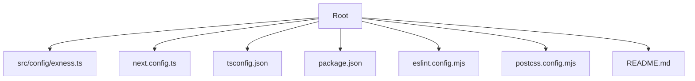
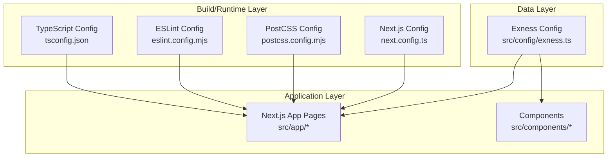
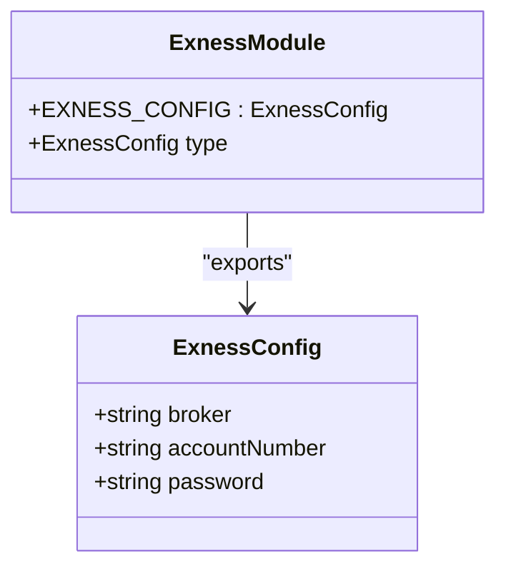
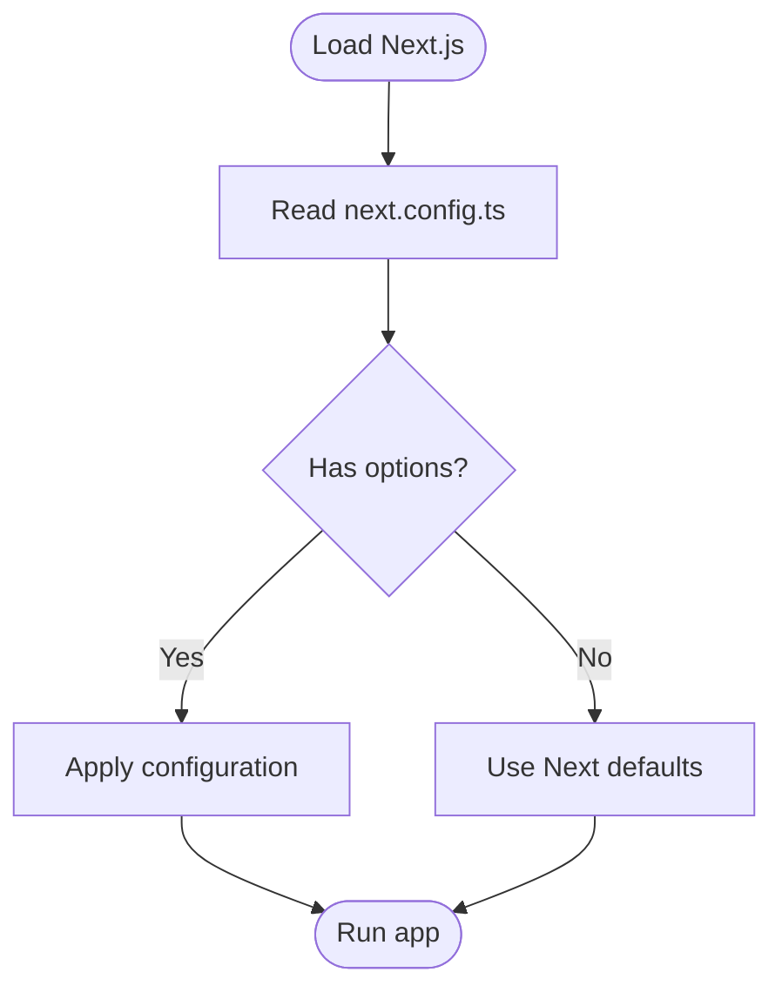
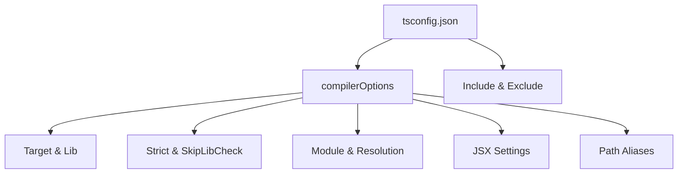
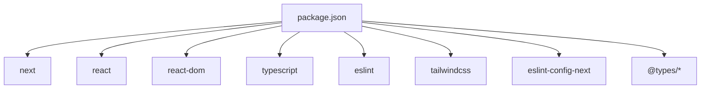

# Configuration & Integration

<cite>
**Referenced Files in This Document**
- [exness.ts](file://src/config/exness.ts)
- [next.config.ts](file://next.config.ts)
- [tsconfig.json](file://tsconfig.json)
- [package.json](file://package.json)
- [eslint.config.mjs](file://eslint.config.mjs)
- [postcss.config.mjs](file://postcss.config.mjs)
- [README.md](file://README.md)
</cite>

## Table of Contents
1. [Introduction](#introduction)
2. [Project Structure](#project-structure)
3. [Core Components](#core-components)
4. [Architecture Overview](#architecture-overview)
5. [Detailed Component Analysis](#detailed-component-analysis)
6. [Dependency Analysis](#dependency-analysis)
7. [Performance Considerations](#performance-considerations)
8. [Troubleshooting Guide](#troubleshooting-guide)
9. [Conclusion](#conclusion)
10. [Appendices](#appendices)

## Introduction
This document explains MOKABotTRADE’s configuration management and external service integration model, focusing on the Exness API configuration module as the central integration point for cryptocurrency trading platform connectivity. It also documents Next.js configuration options, TypeScript compiler settings, and the configuration module pattern used across the application. Practical guidance is included for configuring different trading platforms, managing environment variables, and approaching integration testing while maintaining a clean separation between configuration data and application logic.

## Project Structure
The repository follows a minimal Next.js application layout with a dedicated configuration module for Exness trading platform credentials. Tooling configurations for TypeScript, ESLint, and PostCSS are provided alongside the runtime configuration for Next.js.

**Diagram sources**
- [exness.ts:1-17](file://src/config/exness.ts#L1-L17)
- [next.config.ts:1-8](file://next.config.ts#L1-L8)
- [tsconfig.json:1-35](file://tsconfig.json#L1-L35)
- [package.json:1-27](file://package.json#L1-L27)
- [eslint.config.mjs:1-19](file://eslint.config.mjs#L1-L19)
- [postcss.config.mjs:1-8](file://postcss.config.mjs#L1-L8)
- [README.md:1-37](file://README.md#L1-L37)

**Section sources**
- [exness.ts:1-17](file://src/config/exness.ts#L1-L17)
- [next.config.ts:1-8](file://next.config.ts#L1-L8)
- [tsconfig.json:1-35](file://tsconfig.json#L1-L35)
- [package.json:1-27](file://package.json#L1-L27)
- [eslint.config.mjs:1-19](file://eslint.config.mjs#L1-L19)
- [postcss.config.mjs:1-8](file://postcss.config.mjs#L1-L8)
- [README.md:1-37](file://README.md#L1-L37)

## Core Components
- Exness configuration module: Provides strongly typed constants for broker identity, account number, and platform password. This module encapsulates platform-specific credentials and acts as the single source of truth for Exness integration.
- Next.js configuration: Defines framework-level options via a default export, ready for future extension with build, runtime, and experimental settings.
- TypeScript configuration: Establishes strict type checking, module resolution, JSX handling, and path aliases for concise imports.
- Tooling configurations: ESLint configuration extends Next.js recommended rules and customizes ignores; PostCSS integrates Tailwind plugin support.

Practical implications:
- Centralized credentials reduce duplication and risk exposure.
- Strong typing ensures safer usage of configuration values across the application.
- Path aliases simplify imports and improve maintainability.
- Tooling configurations enforce code quality and consistent formatting.

**Section sources**
- [exness.ts:5-16](file://src/config/exness.ts#L5-L16)
- [next.config.ts:3-5](file://next.config.ts#L3-L5)
- [tsconfig.json:21-23](file://tsconfig.json#L21-L23)
- [eslint.config.mjs:5-16](file://eslint.config.mjs#L5-L16)
- [postcss.config.mjs:1-7](file://postcss.config.mjs#L1-L7)

## Architecture Overview
The configuration architecture separates concerns across three layers:
- Data layer: Platform credentials and identifiers reside in dedicated configuration modules.
- Build/runtime layer: Next.js and tooling configurations orchestrate compilation, linting, and bundling.
- Application layer: Components and services consume configuration values without embedding sensitive data.

**Diagram sources**
- [exness.ts:5-16](file://src/config/exness.ts#L5-L16)
- [tsconfig.json:1-35](file://tsconfig.json#L1-L35)
- [eslint.config.mjs:1-19](file://eslint.config.mjs#L1-L19)
- [postcss.config.mjs:1-8](file://postcss.config.mjs#L1-L8)
- [next.config.ts:1-8](file://next.config.ts#L1-L8)

## Detailed Component Analysis

### Exness Configuration Module
Purpose:
- Encapsulate Exness MT5 credentials and identifiers.
- Provide a strongly typed interface for consumers.
- Enforce immutability of configuration values.

Key characteristics:
- Uses a constant object export to prevent accidental mutation.
- Exposes a TypeScript type derived from the exported object for compile-time safety.
- Includes explanatory comments for each field.

Recommended usage pattern:
- Import the configuration object where platform connectivity is needed.
- Avoid logging or persisting raw credential values.
- Store secrets outside version control and load them at runtime when applicable.

**Diagram sources**
- [exness.ts:5-16](file://src/config/exness.ts#L5-L16)

**Section sources**
- [exness.ts:1-17](file://src/config/exness.ts#L1-L17)

### Next.js Configuration Options
Current state:
- The configuration file exports an empty configuration object, indicating default Next.js behavior.
- Future extensions can include build optimization flags, runtime settings, and experimental features.

Guidance:
- Add build-related options such as output traces, static generation settings, and asset handling.
- Introduce runtime options for environment variable exposure and server runtime behavior.
- Keep environment-specific overrides in deployment pipelines rather than in the repository.

**Diagram sources**
- [next.config.ts:3-5](file://next.config.ts#L3-L5)

**Section sources**
- [next.config.ts:1-8](file://next.config.ts#L1-L8)

### TypeScript Configuration
Compiler options overview:
- Target and library selection align with modern browsers and Node.js environments.
- Strict mode and skipLibCheck enable robust type checking with reduced noise from third-party typings.
- Module and resolution settings favor ES modules and bundler-aware resolution.
- JSX handling configured for React with Next.js.
- Path aliases simplify imports using the @ prefix.

Recommendations:
- Keep incremental builds enabled for faster local development.
- Avoid disabling strict mode unless necessary for legacy code.
- Use resolveJsonModule for JSON assets and isolatedModules for editor performance.

**Diagram sources**
- [tsconfig.json:2-24](file://tsconfig.json#L2-L24)
- [tsconfig.json:25-34](file://tsconfig.json#L25-L34)

**Section sources**
- [tsconfig.json:1-35](file://tsconfig.json#L1-L35)

### Tooling Configurations
- ESLint configuration extends Next.js recommended rules and customizes global ignores to include generated folders and build artifacts.
- PostCSS configuration enables the Tailwind plugin for styling pipeline integration.

Best practices:
- Run linting locally and in CI to catch issues early.
- Keep PostCSS plugins minimal and aligned with design system needs.

**Section sources**
- [eslint.config.mjs:1-19](file://eslint.config.mjs#L1-L19)
- [postcss.config.mjs:1-8](file://postcss.config.mjs#L1-L8)

## Dependency Analysis
Runtime and tooling dependencies are declared in the project manifest. Next.js, React, and related packages form the core stack, while TypeScript and ESLint provide development-time guarantees.

**Diagram sources**
- [package.json:11-25](file://package.json#L11-L25)

**Section sources**
- [package.json:1-27](file://package.json#L1-L27)

## Performance Considerations
- Enable incremental compilation in TypeScript to speed up local builds.
- Use strict mode judiciously; while beneficial, overly strict checks can slow down development iteration.
- Keep path aliases concise and consistent to avoid deep relative imports that complicate caching and tree-shaking.
- Configure Next.js build options thoughtfully to balance bundle size and runtime performance.

## Troubleshooting Guide
Common issues and resolutions:
- Type errors after adding new configuration fields: Ensure the configuration module remains a constant object and derive types from it to keep the type system accurate.
- Import path resolution failures: Verify path aliases match the configured paths and that the project root is correctly set.
- Linting errors in generated files: Confirm global ignores exclude .next, out, and build directories as per the ESLint configuration.
- Styling not applied: Ensure the PostCSS plugin is installed and configured correctly.

**Section sources**
- [tsconfig.json:21-23](file://tsconfig.json#L21-L23)
- [eslint.config.mjs:8-16](file://eslint.config.mjs#L8-L16)
- [postcss.config.mjs:1-7](file://postcss.config.mjs#L1-L7)

## Conclusion
MOKABotTRADE’s configuration system centers on a dedicated, strongly typed Exness configuration module and complementary Next.js, TypeScript, ESLint, and PostCSS configurations. This design enforces a clear separation between configuration data and application logic, supports safe integration with external trading platforms, and provides a scalable foundation for extending to additional platforms and environments.

## Appendices

### Configuration Module Pattern
Pattern summary:
- Define a constant configuration object with explanatory keys.
- Export a TypeScript type derived from the object for compile-time safety.
- Import the configuration where needed; avoid embedding secrets in the repository.
- Use environment variables for runtime-sensitive values and load them securely during deployment.

Example reference paths:
- [Exness configuration object and type:5-16](file://src/config/exness.ts#L5-L16)

**Section sources**
- [exness.ts:5-16](file://src/config/exness.ts#L5-L16)

### Environment Variable Management
Guidelines:
- Store secrets externally (e.g., CI/CD secret stores, platform-specific environment management).
- Load environment variables at runtime and merge them with configuration modules.
- Avoid committing secrets to version control; rely on deployment pipelines for injection.

Reference:
- [Next.js configuration file for future runtime options:3-5](file://next.config.ts#L3-L5)

**Section sources**
- [next.config.ts:3-5](file://next.config.ts#L3-L5)

### Integration Testing Approaches
Approach outline:
- Mock external platform APIs in tests to isolate logic and avoid real network calls.
- Inject configuration modules via dependency injection or test doubles to simulate different platform setups.
- Validate that application logic reacts correctly to configuration changes without altering the configuration itself.

Reference:
- [Exness configuration module for platform credentials:5-16](file://src/config/exness.ts#L5-L16)

**Section sources**
- [exness.ts:5-16](file://src/config/exness.ts#L5-L16)

### Deployment Configuration Notes
- Follow Next.js deployment documentation for production builds and runtime behavior.
- Ensure environment variables are properly injected in the target environment.
- Keep configuration modules immutable and free of secrets to maintain portability across environments.

Reference:
- [README deployment guidance:32-36](file://README.md#L32-L36)

**Section sources**
- [README.md:32-36](file://README.md#L32-L36)