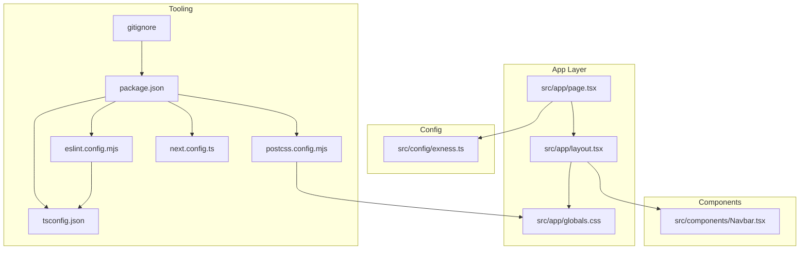
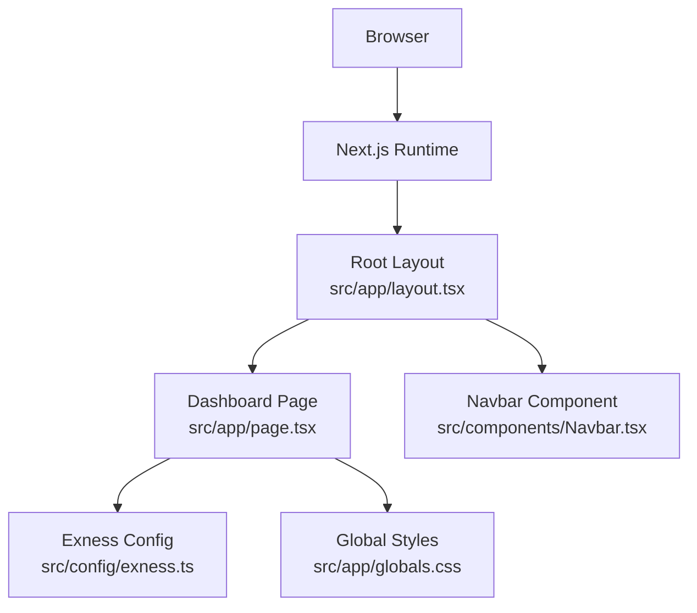
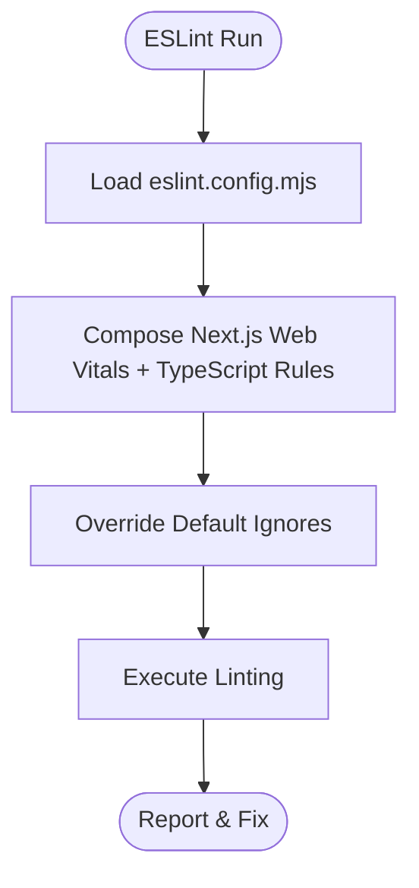
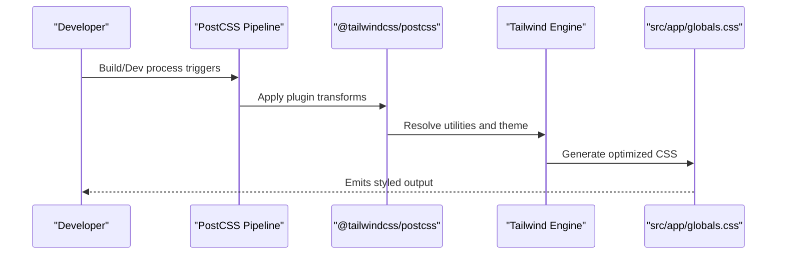
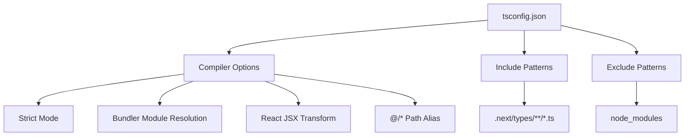
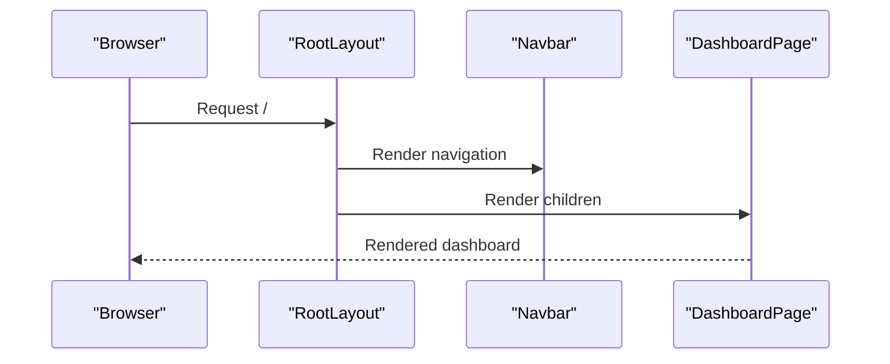
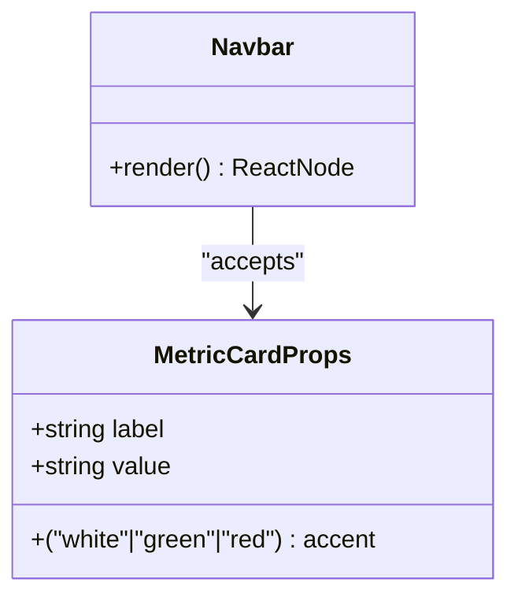
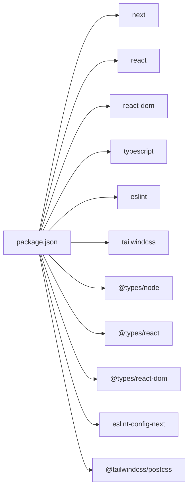

# Development Guidelines

<cite>
**Referenced Files in This Document**
- [package.json](file://package.json)
- [eslint.config.mjs](file://eslint.config.mjs)
- [postcss.config.mjs](file://postcss.config.mjs)
- [tsconfig.json](file://tsconfig.json)
- [next.config.ts](file://next.config.ts)
- [.gitignore](file://.gitignore)
- [src/app/globals.css](file://src/app/globals.css)
- [src/app/layout.tsx](file://src/app/layout.tsx)
- [src/app/page.tsx](file://src/app/page.tsx)
- [src/components/Navbar.tsx](file://src/components/Navbar.tsx)
- [src/config/exness.ts](file://src/config/exness.ts)
- [README.md](file://README.md)
- [AGENTS.md](file://AGENTS.md)
</cite>

## Table of Contents
1. [Introduction](#introduction)
2. [Project Structure](#project-structure)
3. [Core Components](#core-components)
4. [Architecture Overview](#architecture-overview)
5. [Detailed Component Analysis](#detailed-component-analysis)
6. [Dependency Analysis](#dependency-analysis)
7. [Performance Considerations](#performance-considerations)
8. [Troubleshooting Guide](#troubleshooting-guide)
9. [Conclusion](#conclusion)
10. [Appendices](#appendices)

## Introduction
This document defines development guidelines for the MOKABotTRADE project. It consolidates the current toolchain configurations and component patterns to establish consistent standards for code quality, TypeScript usage, CSS processing via PostCSS/Tailwind, and development workflows. It also provides extension guidelines for integrating new trading platforms and UI components while preserving type safety and maintainability.

## Project Structure
The project follows a Next.js App Router layout with a small set of core files:
- Application shell and pages under src/app
- Shared UI components under src/components
- Global styles under src/app/globals.css
- Configuration constants under src/config
- Toolchain configurations at the repository root

**Diagram sources**
- [src/app/layout.tsx:1-38](file://src/app/layout.tsx#L1-L38)
- [src/app/page.tsx:1-188](file://src/app/page.tsx#L1-L188)
- [src/app/globals.css:1-31](file://src/app/globals.css#L1-L31)
- [src/components/Navbar.tsx:1-100](file://src/components/Navbar.tsx#L1-L100)
- [src/config/exness.ts:1-17](file://src/config/exness.ts#L1-L17)
- [package.json:1-27](file://package.json#L1-L27)
- [eslint.config.mjs:1-19](file://eslint.config.mjs#L1-L19)
- [postcss.config.mjs:1-8](file://postcss.config.mjs#L1-L8)
- [tsconfig.json:1-35](file://tsconfig.json#L1-L35)
- [next.config.ts:1-8](file://next.config.ts#L1-L8)
- [.gitignore:1-42](file://.gitignore#L1-L42)

**Section sources**
- [src/app/layout.tsx:1-38](file://src/app/layout.tsx#L1-L38)
- [src/app/page.tsx:1-188](file://src/app/page.tsx#L1-L188)
- [src/app/globals.css:1-31](file://src/app/globals.css#L1-L31)
- [src/components/Navbar.tsx:1-100](file://src/components/Navbar.tsx#L1-L100)
- [src/config/exness.ts:1-17](file://src/config/exness.ts#L1-L17)
- [package.json:1-27](file://package.json#L1-L27)
- [eslint.config.mjs:1-19](file://eslint.config.mjs#L1-L19)
- [postcss.config.mjs:1-8](file://postcss.config.mjs#L1-L8)
- [tsconfig.json:1-35](file://tsconfig.json#L1-L35)
- [next.config.ts:1-8](file://next.config.ts#L1-L8)
- [.gitignore:1-42](file://.gitignore#L1-L42)

## Core Components
- ESLint configuration composes Next.js recommended rules for web vitals and TypeScript, with explicit overrides for default ignores.
- PostCSS configuration integrates Tailwind CSS v4 via @tailwindcss/postcss.
- TypeScript compiler options enable strict mode, JSX transform, bundler module resolution, and path aliases.
- Next.js configuration is present but currently empty; it serves as a hook for future framework-level adjustments.
- Git ignore excludes build artifacts, logs, and environment files by default.

**Section sources**
- [eslint.config.mjs:1-19](file://eslint.config.mjs#L1-L19)
- [postcss.config.mjs:1-8](file://postcss.config.mjs#L1-L8)
- [tsconfig.json:1-35](file://tsconfig.json#L1-L35)
- [next.config.ts:1-8](file://next.config.ts#L1-L8)
- [.gitignore:1-42](file://.gitignore#L1-L42)

## Architecture Overview
The runtime architecture centers on Next.js App Router rendering, with Tailwind CSS providing atomic styling and a minimal TypeScript configuration enforcing type safety.

**Diagram sources**
- [src/app/layout.tsx:1-38](file://src/app/layout.tsx#L1-L38)
- [src/app/page.tsx:1-188](file://src/app/page.tsx#L1-L188)
- [src/components/Navbar.tsx:1-100](file://src/components/Navbar.tsx#L1-L100)
- [src/app/globals.css:1-31](file://src/app/globals.css#L1-L31)
- [src/config/exness.ts:1-17](file://src/config/exness.ts#L1-L17)

## Detailed Component Analysis

### ESLint Configuration
- Composition: Uses eslint-config-next for core-web-vitals and TypeScript rules.
- Overrides: Explicitly redefines global ignores to align with project needs.
- Purpose: Enforces code quality, accessibility, and modern best practices for Next.js + TypeScript projects.

**Diagram sources**
- [eslint.config.mjs:1-19](file://eslint.config.mjs#L1-L19)

**Section sources**
- [eslint.config.mjs:1-19](file://eslint.config.mjs#L1-L19)

### PostCSS and Tailwind CSS Integration
- PostCSS plugin: @tailwindcss/postcss is configured at the repository root.
- Global CSS: Tailwind directives and theme tokens are declared in src/app/globals.css.
- Font integration: Next/font providers are wired in the root layout.

**Diagram sources**
- [postcss.config.mjs:1-8](file://postcss.config.mjs#L1-L8)
- [src/app/globals.css:1-31](file://src/app/globals.css#L1-L31)
- [src/app/layout.tsx:1-38](file://src/app/layout.tsx#L1-L38)

**Section sources**
- [postcss.config.mjs:1-8](file://postcss.config.mjs#L1-L8)
- [src/app/globals.css:1-31](file://src/app/globals.css#L1-L31)
- [src/app/layout.tsx:1-38](file://src/app/layout.tsx#L1-L38)

### TypeScript Configuration
- Strictness: Enabled strict type checking and noEmit for compile-time safety.
- Module Resolution: Bundler-based resolution supports modern toolchains.
- JSX Transform: React JSX runtime is configured.
- Path Aliases: @/* resolves to ./src for concise imports.
- Includes/Excludes: Comprehensive coverage for TS/TSX and Next’s generated types.

**Diagram sources**
- [tsconfig.json:1-35](file://tsconfig.json#L1-L35)

**Section sources**
- [tsconfig.json:1-35](file://tsconfig.json#L1-L35)

### Next.js Configuration
- Current state: Empty configuration object allows defaults.
- Future extensibility: Add image optimization, redirects, headers, and experimental features here.

**Section sources**
- [next.config.ts:1-8](file://next.config.ts#L1-L8)

### Application Shell and Pages
- Root layout: Provides metadata, fonts, global CSS, and wraps children in a consistent HTML skeleton.
- Dashboard page: Demonstrates TypeScript interfaces, helper functions, and Tailwind-styled components for a trading table.

**Diagram sources**
- [src/app/layout.tsx:1-38](file://src/app/layout.tsx#L1-L38)
- [src/components/Navbar.tsx:1-100](file://src/components/Navbar.tsx#L1-L100)
- [src/app/page.tsx:1-188](file://src/app/page.tsx#L1-L188)

**Section sources**
- [src/app/layout.tsx:1-38](file://src/app/layout.tsx#L1-L38)
- [src/app/page.tsx:1-188](file://src/app/page.tsx#L1-L188)
- [src/components/Navbar.tsx:1-100](file://src/components/Navbar.tsx#L1-L100)

### Component Development Example: Navbar
- Props typing: MetricCardProps interface ensures type-safe props.
- Conditional styling: Accent variants mapped via a color map.
- Client directive: Marks component for client-side rendering.

**Diagram sources**
- [src/components/Navbar.tsx:1-100](file://src/components/Navbar.tsx#L1-L100)

**Section sources**
- [src/components/Navbar.tsx:1-100](file://src/components/Navbar.tsx#L1-L100)

### Configuration Constants: Exness
- Immutable configuration: EXNESS_CONFIG exported as const to prevent mutations.
- Type alias: ExnessConfig mirrors the runtime shape for type consumers.

**Section sources**
- [src/config/exness.ts:1-17](file://src/config/exness.ts#L1-L17)

## Dependency Analysis
- Toolchain dependencies: Next.js, React, TypeScript, ESLint, Tailwind CSS v4, and related type definitions.
- Scripts: Development, build, start, and lint commands are defined in package.json.
- Ignored paths: Build outputs, logs, and environment files are excluded from version control.

**Diagram sources**
- [package.json:1-27](file://package.json#L1-L27)

**Section sources**
- [package.json:1-27](file://package.json#L1-L27)
- [.gitignore:1-42](file://.gitignore#L1-L42)

## Performance Considerations
- Font optimization: next/font is used to self-host and optimize font delivery.
- Minimal build artifacts: Keep .next, out, and build directories ignored and avoid committing generated assets.
- CSS scope: Prefer component-scoped Tailwind utilities to reduce bundle weight.
- Strict mode: Leverage TypeScript strictness to catch performance-related bugs early.

[No sources needed since this section provides general guidance]

## Troubleshooting Guide
- Lint failures: Run the lint script to identify and fix issues aligned with Next.js and TypeScript rules.
- Build errors: Verify tsconfig.json includes necessary files and excludes node_modules.
- Styling issues: Confirm Tailwind directives and PostCSS plugin are present and that global CSS is imported in the root layout.
- Environment concerns: Ensure sensitive configuration remains out of version control and use .env* exclusions.

**Section sources**
- [package.json:5-10](file://package.json#L5-L10)
- [tsconfig.json:25-33](file://tsconfig.json#L25-L33)
- [postcss.config.mjs:1-8](file://postcss.config.mjs#L1-L8)
- [src/app/layout.tsx:1-38](file://src/app/layout.tsx#L1-L38)
- [.gitignore:33-42](file://.gitignore#L33-L42)

## Conclusion
These guidelines formalize the existing toolchain and component patterns in MOKABotTRADE. By adhering to the ESLint and TypeScript configurations, leveraging Tailwind CSS via PostCSS, and following the component architecture demonstrated by Navbar and the dashboard page, contributors can extend the application reliably. The provided extension guidelines below will help integrate new trading platforms and UI components while maintaining type safety and code quality.

## Appendices

### A. ESLint, TypeScript, and PostCSS Standards
- ESLint
  - Use the provided configuration; avoid disabling rules unless absolutely necessary and document the rationale.
  - Run the lint script regularly during development.
- TypeScript
  - Keep strict mode enabled; introduce new types via interfaces and enums.
  - Use path aliases (@/*) for clean imports.
- PostCSS and Tailwind
  - Place global styles in src/app/globals.css.
  - Use Tailwind utilities for component styling; avoid ad-hoc CSS where utilities suffice.

**Section sources**
- [eslint.config.mjs:1-19](file://eslint.config.mjs#L1-L19)
- [tsconfig.json:1-35](file://tsconfig.json#L1-L35)
- [postcss.config.mjs:1-8](file://postcss.config.mjs#L1-L8)
- [src/app/globals.css:1-31](file://src/app/globals.css#L1-L31)

### B. Package Scripts
- Development: Start the Next.js dev server.
- Build: Produce an optimized static/SSR build.
- Start: Serve the built application.
- Lint: Execute ESLint against the codebase.

**Section sources**
- [package.json:5-10](file://package.json#L5-L10)

### C. Component Development Standards
- Naming
  - Use PascalCase for component filenames and export names.
  - Use camelCase for prop names and local variables.
- File Organization
  - Place shared components under src/components.
  - Place page-level components under src/app.
- Type Safety
  - Define props via TypeScript interfaces.
  - Export const configuration objects to prevent mutation.
- Styling
  - Prefer Tailwind utilities; keep scoped styles in component CSS modules or global CSS.
- Accessibility
  - Provide semantic markup and meaningful alt texts.

**Section sources**
- [src/components/Navbar.tsx:1-100](file://src/components/Navbar.tsx#L1-L100)
- [src/config/exness.ts:1-17](file://src/config/exness.ts#L1-L17)

### D. Extending with New Trading Platforms
- Configuration
  - Add a new configuration file under src/config/<platform>.ts with a const object and a corresponding type alias.
- Data Integration
  - Introduce a service module to fetch and normalize data; keep side effects isolated.
- UI Updates
  - Extend the dashboard page to render platform-specific data using the same patterns (interfaces, helpers, Tailwind classes).
- Security
  - Treat credentials as sensitive; never commit secrets; rely on environment variables and .env* exclusions.

**Section sources**
- [src/config/exness.ts:1-17](file://src/config/exness.ts#L1-L17)
- [src/app/page.tsx:1-188](file://src/app/page.tsx#L1-L188)

### E. Adding New UI Components
- Create a new component under src/components with a clear interface and minimal side effects.
- Use the existing Navbar pattern: define props via interfaces, apply Tailwind utilities, and mark client components when needed.
- Export a default component and reuse it across pages.

**Section sources**
- [src/components/Navbar.tsx:1-100](file://src/components/Navbar.tsx#L1-L100)

### F. Working with Next.js and React in TypeScript
- App Router
  - Use src/app for pages and layouts; leverage metadata and fonts at the root layout.
- Strict Types
  - Enable strict mode and use readonly props for page components.
- Fonts
  - Utilize next/font providers for optimized loading.

**Section sources**
- [src/app/layout.tsx:1-38](file://src/app/layout.tsx#L1-L38)
- [tsconfig.json:7-14](file://tsconfig.json#L7-L14)

### G. Debugging Techniques
- Linting
  - Run the lint script to surface potential issues early.
- Type Checking
  - Rely on TypeScript strict mode to catch runtime errors at compile time.
- Styling
  - Inspect generated CSS and ensure Tailwind directives are applied.

**Section sources**
- [package.json:9-10](file://package.json#L9-L10)
- [tsconfig.json:7-14](file://tsconfig.json#L7-L14)
- [postcss.config.mjs:1-8](file://postcss.config.mjs#L1-L8)

### H. Deployment and Getting Started
- Development server
  - Use the dev script to start the local server.
- Documentation
  - Refer to the project README for initial setup and Next.js basics.

**Section sources**
- [package.json:5-10](file://package.json#L5-L10)
- [README.md:1-37](file://README.md#L1-L37)
- [AGENTS.md:1-6](file://AGENTS.md#L1-L6)