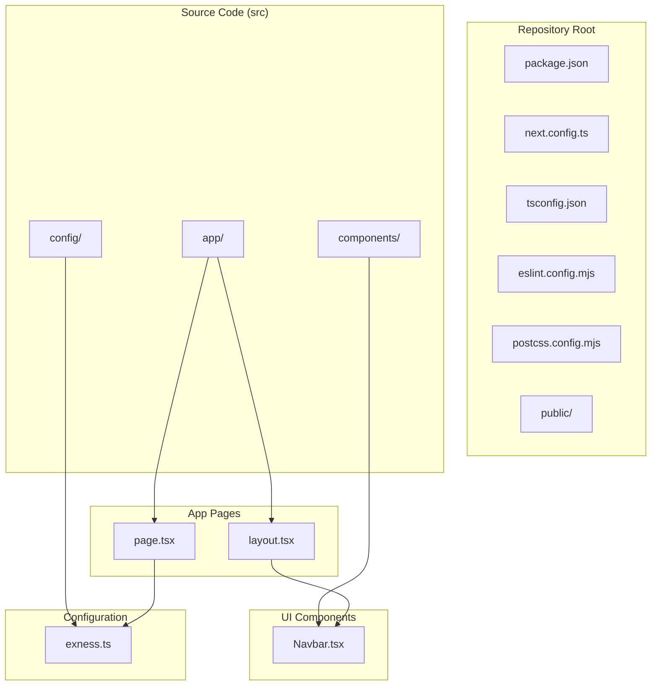
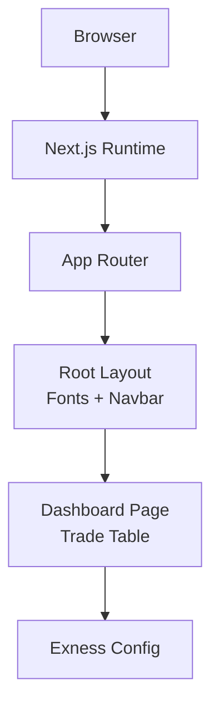
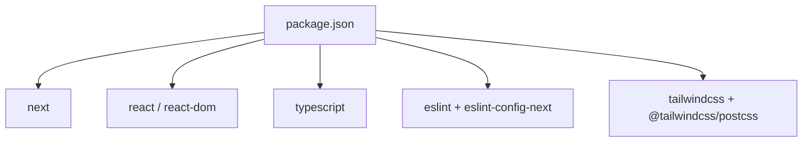

# Getting Started

<cite>
**Referenced Files in This Document**
- [README.md](file://README.md)
- [package.json](file://package.json)
- [next.config.ts](file://next.config.ts)
- [tsconfig.json](file://tsconfig.json)
- [postcss.config.mjs](file://postcss.config.mjs)
- [eslint.config.mjs](file://eslint.config.mjs)
- [src/app/layout.tsx](file://src/app/layout.tsx)
- [src/app/page.tsx](file://src/app/page.tsx)
- [src/components/Navbar.tsx](file://src/components/Navbar.tsx)
- [src/config/exness.ts](file://src/config/exness.ts)
</cite>

## Table of Contents
1. [Introduction](#introduction)
2. [Project Structure](#project-structure)
3. [Core Components](#core-components)
4. [Architecture Overview](#architecture-overview)
5. [Detailed Component Analysis](#detailed-component-analysis)
6. [Dependency Analysis](#dependency-analysis)
7. [Performance Considerations](#performance-considerations)
8. [Troubleshooting Guide](#troubleshooting-guide)
9. [Conclusion](#conclusion)
10. [Appendices](#appendices)

## Introduction
MOKABotTRADE is a Next.js application that displays live trading data from an Exness MT5 account. It uses a modern React-based UI with TypeScript, Tailwind CSS via PostCSS, and Next.js App Router conventions. The application is designed to run locally during development and can be deployed to platforms that support Next.js applications.

## Project Structure
The repository follows a standard Next.js App Router layout with a clear separation of concerns:
- Public assets are served from the public directory.
- Application pages and shared UI components reside under src/.
- The root-level configuration files define build tooling, linting, and TypeScript settings.
- The src/app directory contains the main page and layout, while reusable components are under src/components.
- Environment-specific configuration is encapsulated in src/config.

**Diagram sources**
- [package.json](file://package.json)
- [next.config.ts](file://next.config.ts)
- [tsconfig.json](file://tsconfig.json)
- [eslint.config.mjs](file://eslint.config.mjs)
- [postcss.config.mjs](file://postcss.config.mjs)
- [src/app/layout.tsx](file://src/app/layout.tsx)
- [src/app/page.tsx](file://src/app/page.tsx)
- [src/components/Navbar.tsx](file://src/components/Navbar.tsx)
- [src/config/exness.ts](file://src/config/exness.ts)

**Section sources**
- [README.md](file://README.md)
- [package.json](file://package.json)
- [next.config.ts](file://next.config.ts)
- [tsconfig.json](file://tsconfig.json)
- [postcss.config.mjs](file://postcss.config.mjs)
- [eslint.config.mjs](file://eslint.config.mjs)
- [src/app/layout.tsx](file://src/app/layout.tsx)
- [src/app/page.tsx](file://src/app/page.tsx)
- [src/components/Navbar.tsx](file://src/components/Navbar.tsx)
- [src/config/exness.ts](file://src/config/exness.ts)

## Core Components
- Application entry points and routing are defined by Next.js App Router conventions in src/app.
- The root layout integrates fonts and the global navigation bar.
- The main dashboard page renders mock trading data and calculates summary metrics.
- The Navbar component presents live-like trading metrics and bot status indicators.
- The Exness configuration module centralizes broker and account credentials.

Key implementation references:
- Root layout and metadata: [src/app/layout.tsx](file://src/app/layout.tsx)
- Main dashboard page and trade table rendering: [src/app/page.tsx](file://src/app/page.tsx)
- Navigation bar and metric cards: [src/components/Navbar.tsx](file://src/components/Navbar.tsx)
- Exness configuration constants: [src/config/exness.ts](file://src/config/exness.ts)

**Section sources**
- [src/app/layout.tsx](file://src/app/layout.tsx)
- [src/app/page.tsx](file://src/app/page.tsx)
- [src/components/Navbar.tsx](file://src/components/Navbar.tsx)
- [src/config/exness.ts](file://src/config/exness.ts)

## Architecture Overview
The application is structured around Next.js App Router, with a focus on server-side rendering and static generation capabilities. The build pipeline leverages TypeScript compilation, PostCSS for styling, and ESLint for code quality. Runtime behavior is controlled by Next.js configuration.

**Diagram sources**
- [src/app/layout.tsx](file://src/app/layout.tsx)
- [src/app/page.tsx](file://src/app/page.tsx)
- [src/config/exness.ts](file://src/config/exness.ts)

**Section sources**
- [next.config.ts](file://next.config.ts)
- [tsconfig.json](file://tsconfig.json)
- [postcss.config.mjs](file://postcss.config.mjs)
- [eslint.config.mjs](file://eslint.config.mjs)
- [src/app/layout.tsx](file://src/app/layout.tsx)
- [src/app/page.tsx](file://src/app/page.tsx)
- [src/config/exness.ts](file://src/config/exness.ts)

## Detailed Component Analysis

### Development Server Startup
The development server can be launched using any of the supported package managers. The scripts are defined in the project’s package.json and executed via the commands documented in the repository’s README.

- Supported package managers: npm, yarn, pnpm, bun
- Development command: next dev
- Access URL: http://localhost:3000

Practical examples:
- npm run dev
- yarn dev
- pnpm dev
- bun dev

Verification steps:
- After starting the server, open http://localhost:3000 in your browser.
- Confirm that the dashboard page renders with the “Active Trades” header and a table of mock trades.
- Verify that the Navbar displays metrics and bot status indicators.

**Section sources**
- [README.md](file://README.md)
- [package.json](file://package.json)

### Environment Variables and Configuration
- No runtime environment variables are referenced in the provided source files.
- The Exness configuration module defines constants for broker, account number, and password. These are intended for local development and should not be committed to public repositories.

Recommendations:
- Keep sensitive credentials secure and outside version control.
- For production deployments, use platform-specific environment variable injection mechanisms.

**Section sources**
- [src/config/exness.ts](file://src/config/exness.ts)

### Project Structure Exploration
- src/app: Contains the root layout and the main page component.
- src/components: Houses reusable UI components such as the navigation bar.
- src/config: Stores configuration modules like Exness credentials.
- Root configuration files:
  - next.config.ts: Next.js configuration container.
  - tsconfig.json: TypeScript compiler options and path aliases.
  - eslint.config.mjs: ESLint configuration extending Next.js defaults.
  - postcss.config.mjs: PostCSS configuration integrating Tailwind CSS.

**Section sources**
- [next.config.ts](file://next.config.ts)
- [tsconfig.json](file://tsconfig.json)
- [eslint.config.mjs](file://eslint.config.mjs)
- [postcss.config.mjs](file://postcss.config.mjs)
- [src/app/layout.tsx](file://src/app/layout.tsx)
- [src/app/page.tsx](file://src/app/page.tsx)
- [src/components/Navbar.tsx](file://src/components/Navbar.tsx)
- [src/config/exness.ts](file://src/config/exness.ts)

## Dependency Analysis
The project relies on Next.js and React for the framework and UI, with TypeScript for type safety and Tailwind CSS via PostCSS for styling. Development tooling includes ESLint and related configurations.

**Diagram sources**
- [package.json](file://package.json)

**Section sources**
- [package.json](file://package.json)

## Performance Considerations
- Use the production build command to generate optimized artifacts for deployment.
- Leverage Next.js automatic optimizations such as image optimization and font optimization.
- Keep dependencies updated to benefit from performance improvements and bug fixes.

## Troubleshooting Guide
Common setup issues and resolutions:
- Port already in use
  - The development server runs on port 3000 by default. If the port is occupied, stop the conflicting process or configure the server to use another port via your package manager’s script customization.
- Package manager compatibility
  - Ensure you are using one of the supported package managers: npm, yarn, pnpm, or bun. Switching between them should not affect functionality as long as dependencies are installed consistently.
- Node.js version requirements
  - The project uses modern JavaScript and TypeScript features. Use a current LTS or actively supported Node.js version compatible with the specified dependencies.
- Missing dependencies after clone
  - Run your chosen package manager’s install command to populate node_modules and package-lock files.
- Browser not reflecting changes
  - Hard refresh the browser tab or restart the development server to ensure updates are applied.
- TypeScript or ESLint errors
  - Review the lint configuration and fix reported issues. The project extends Next.js ESLint configurations.

**Section sources**
- [README.md](file://README.md)
- [package.json](file://package.json)
- [tsconfig.json](file://tsconfig.json)
- [eslint.config.mjs](file://eslint.config.mjs)

## Conclusion
You are ready to develop and run MOKABotTRADE locally using any of the supported package managers. Start the development server, navigate to http://localhost:3000, and explore the dashboard and components. Keep sensitive configuration secure and leverage the provided tooling for a smooth development experience.

## Appendices
- Deployment preparation
  - Build the project using the build script and deploy the output to a Next.js-compatible hosting platform.

**Section sources**
- [README.md](file://README.md)
- [package.json](file://package.json)