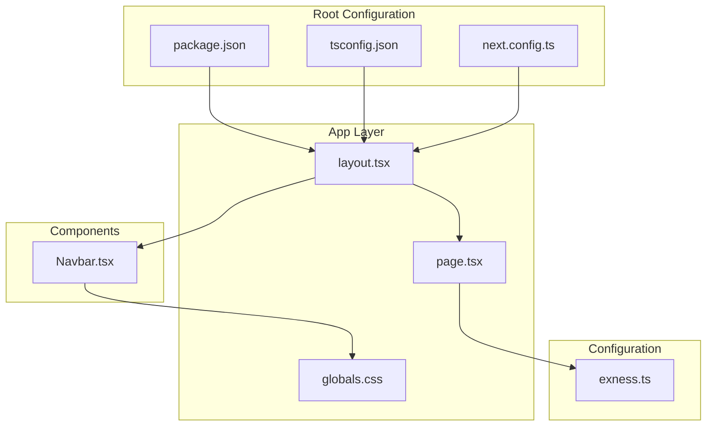
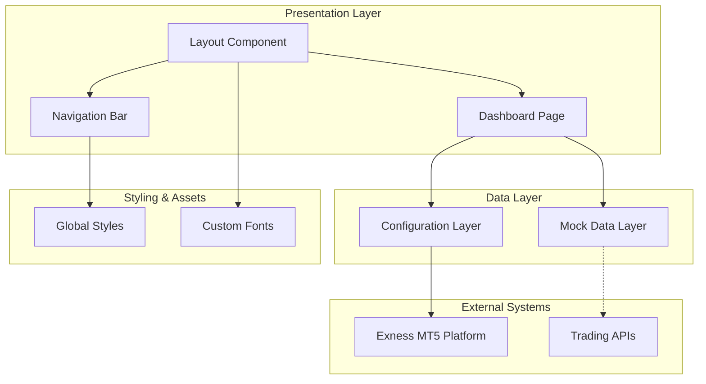
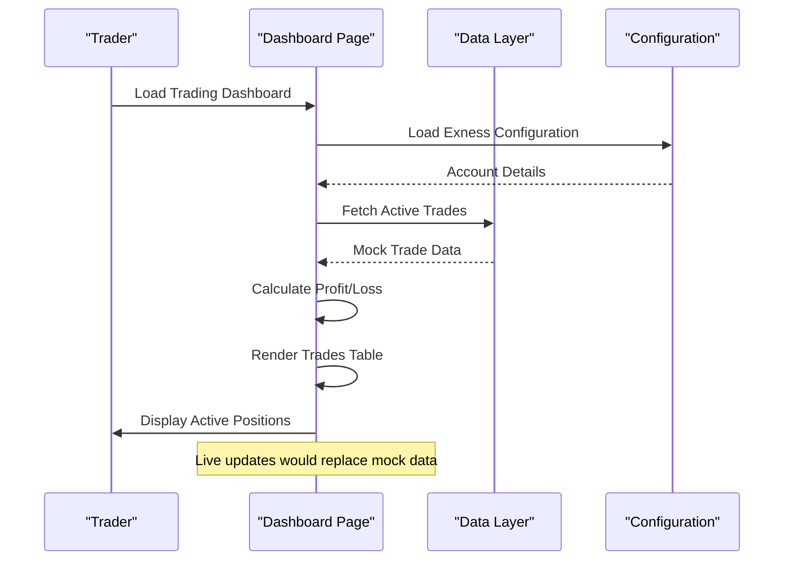
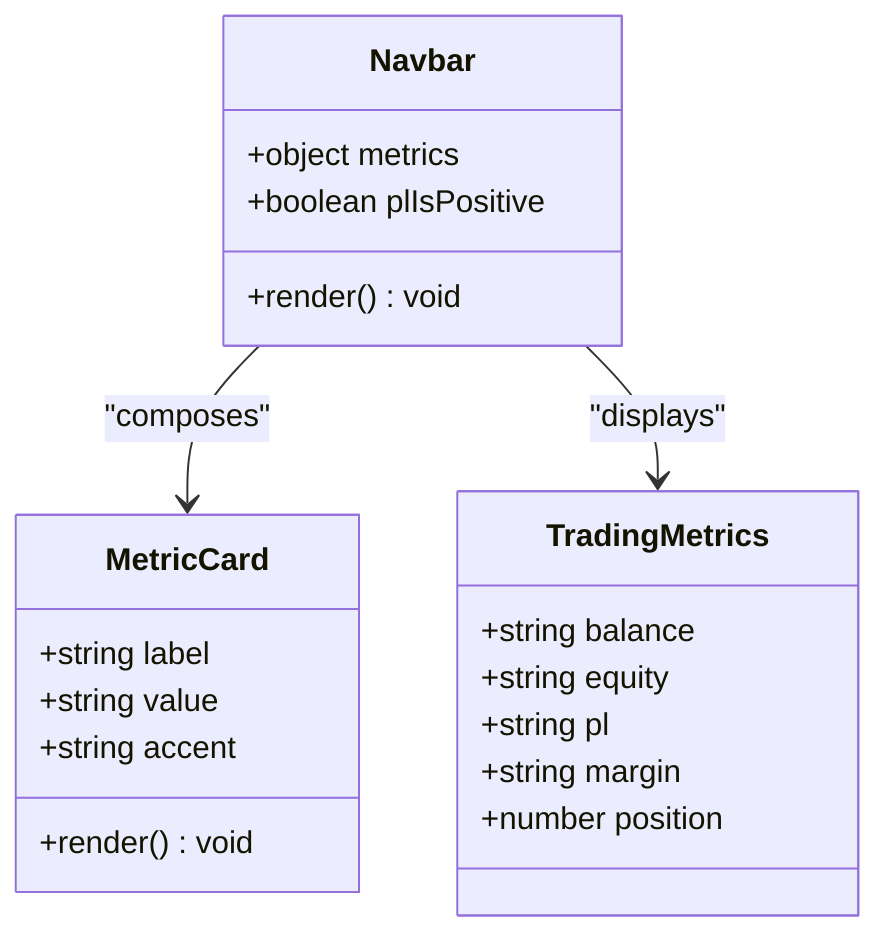
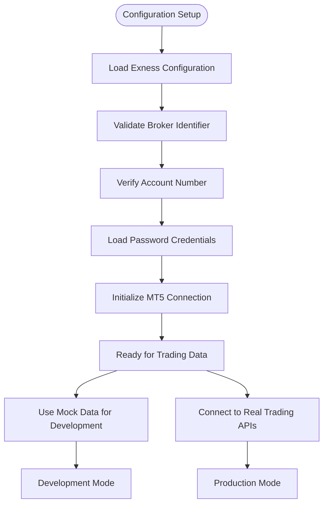
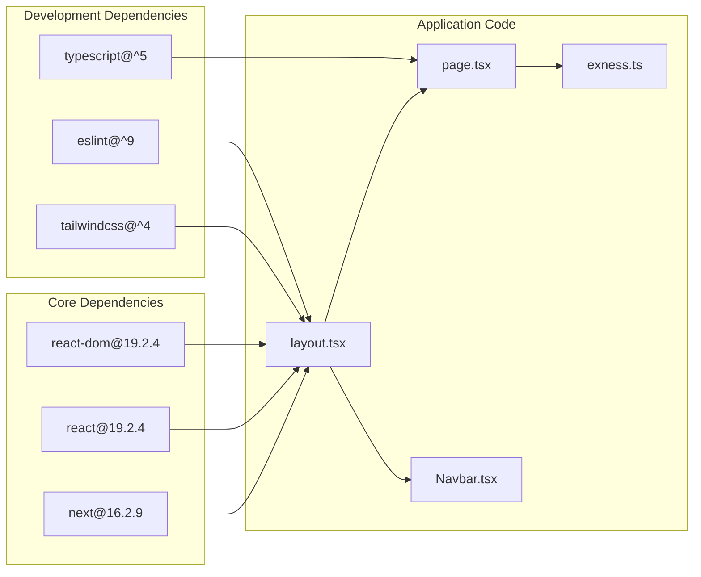

# Project Overview

<cite>
**Referenced Files in This Document**
- [README.md](file://README.md)
- [package.json](file://package.json)
- [src/app/layout.tsx](file://src/app/layout.tsx)
- [src/app/page.tsx](file://src/app/page.tsx)
- [src/components/Navbar.tsx](file://src/components/Navbar.tsx)
- [src/config/exness.ts](file://src/config/exness.ts)
- [src/app/globals.css](file://src/app/globals.css)
- [next.config.ts](file://next.config.ts)
- [tsconfig.json](file://tsconfig.json)
</cite>

## Table of Contents
1. [Introduction](#introduction)
2. [Project Structure](#project-structure)
3. [Core Components](#core-components)
4. [Architecture Overview](#architecture-overview)
5. [Detailed Component Analysis](#detailed-component-analysis)
6. [Dependency Analysis](#dependency-analysis)
7. [Performance Considerations](#performance-considerations)
8. [Troubleshooting Guide](#troubleshooting-guide)
9. [Conclusion](#conclusion)

## Introduction
MOKABotTRADE is a cryptocurrency trading dashboard built with Next.js that provides real-time visibility into active trades and trading metrics. The project targets two primary audiences:
- Traders who need a clean, real-time view of their open positions and profit/loss calculations
- Developers building trading applications or integrating with Exness MT5

Key features demonstrated in the current implementation include:
- Real-time trading visualization of active trades with live profit/loss calculation
- Active trades management through a responsive table interface
- Exness MT5 integration scaffolding with account configuration
- Trading metrics display including balance, equity, profit/loss, margin, and position count
- Responsive design optimized for desktop and mobile trading workflows

The dashboard follows modern trading workflows by presenting critical trading information at a glance, enabling quick decision-making during market volatility. The implementation demonstrates a frontend-first approach that can be extended with real-time data sources while maintaining a clean separation between presentation and data access layers.

## Project Structure
The project follows Next.js App Router conventions with a minimal, focused structure optimized for a trading dashboard:

**Diagram sources**
- [src/app/layout.tsx:1-38](file://src/app/layout.tsx#L1-L38)
- [src/app/page.tsx:1-188](file://src/app/page.tsx#L1-L188)
- [src/components/Navbar.tsx:1-100](file://src/components/Navbar.tsx#L1-L100)
- [src/config/exness.ts:1-17](file://src/config/exness.ts#L1-L17)

**Section sources**
- [package.json:1-27](file://package.json#L1-L27)
- [tsconfig.json:1-35](file://tsconfig.json#L1-L35)
- [next.config.ts:1-8](file://next.config.ts#L1-L8)

## Core Components
The dashboard consists of several core components that work together to deliver a comprehensive trading experience:

### Trading Dashboard Layout
The main dashboard page implements a structured layout that presents trading data in an intuitive format. It includes:
- Header section with active trades count and synchronization status
- Comprehensive trades table displaying ticket numbers, symbols, trade types, volumes, entry prices, stop-loss, take-profit levels, live profit/loss, and timestamps
- Summary footer showing total profit/loss across all positions
- Responsive design that adapts to different screen sizes

### Navigation Bar
The navigation bar provides essential trading metrics and system status:
- Branding with MokaBot logo and live status indicator
- Real-time metrics including balance, equity, profit/loss, margin, and position count
- Mobile-responsive design with compact metric display
- Live status indicator with animated glow effect

### Exness MT5 Integration
The configuration module establishes the foundation for Exness MT5 integration:
- Account configuration including broker identifier, account number, and password
- Type-safe configuration interface for compile-time safety
- Secure credential storage separate from application logic

**Section sources**
- [src/app/page.tsx:95-187](file://src/app/page.tsx#L95-L187)
- [src/components/Navbar.tsx:30-99](file://src/components/Navbar.tsx#L30-L99)
- [src/config/exness.ts:5-14](file://src/config/exness.ts#L5-L14)

## Architecture Overview
MOKABotTRADE follows a frontend-only architecture designed for rapid iteration and deployment:

**Diagram sources**
- [src/app/layout.tsx:21-37](file://src/app/layout.tsx#L21-L37)
- [src/app/page.tsx:95-187](file://src/app/page.tsx#L95-L187)
- [src/components/Navbar.tsx:30-99](file://src/components/Navbar.tsx#L30-L99)
- [src/config/exness.ts:5-14](file://src/config/exness.ts#L5-L14)

The architecture emphasizes:
- Clean separation between presentation and data logic
- Extensible mock data system ready for API integration
- Responsive design for modern trading workflows
- Type-safe configuration management

## Detailed Component Analysis

### Trading Dashboard Implementation
The dashboard page implements a comprehensive trading interface with the following key features:

**Diagram sources**
- [src/app/page.tsx:95-187](file://src/app/page.tsx#L95-L187)
- [src/config/exness.ts:5-14](file://src/config/exness.ts#L5-L14)

The implementation includes sophisticated data presentation logic:
- Dynamic profit/loss coloring (green for positive, red for negative)
- Formatted numeric displays with appropriate precision
- Interactive hover states for improved usability
- Responsive table layout with horizontal scrolling for small screens

### Navigation Bar Metrics System
The navigation bar implements a metrics dashboard that displays critical trading information:

**Diagram sources**
- [src/components/Navbar.tsx:6-28](file://src/components/Navbar.tsx#L6-L28)
- [src/components/Navbar.tsx:30-99](file://src/components/Navbar.tsx#L30-L99)

The metrics system provides:
- Real-time balance and equity tracking
- Profit/loss calculation with color-coded indicators
- Margin and position monitoring
- Mobile-optimized metric display

### Exness MT5 Integration Framework
The configuration system establishes the foundation for Exness MT5 integration:

**Diagram sources**
- [src/config/exness.ts:5-14](file://src/config/exness.ts#L5-L14)

**Section sources**
- [src/app/page.tsx:1-188](file://src/app/page.tsx#L1-L188)
- [src/components/Navbar.tsx:1-100](file://src/components/Navbar.tsx#L1-L100)
- [src/config/exness.ts:1-17](file://src/config/exness.ts#L1-L17)

## Dependency Analysis
The project maintains a lean dependency graph optimized for a trading dashboard:

**Diagram sources**
- [package.json:11-25](file://package.json#L11-L25)
- [src/app/layout.tsx:1-38](file://src/app/layout.tsx#L1-L38)
- [src/app/page.tsx:1-188](file://src/app/page.tsx#L1-L188)
- [src/components/Navbar.tsx:1-100](file://src/components/Navbar.tsx#L1-L100)
- [src/config/exness.ts:1-17](file://src/config/exness.ts#L1-L17)

**Section sources**
- [package.json:1-27](file://package.json#L1-L27)
- [tsconfig.json:1-35](file://tsconfig.json#L1-L35)

## Performance Considerations
The dashboard is optimized for trading scenarios with the following considerations:
- Minimal bundle size through selective dependency usage
- Efficient rendering with React's virtual DOM
- Optimized font loading with Next.js font optimization
- Responsive design reducing layout thrashing on mobile devices
- CSS animations limited to essential status indicators

## Troubleshooting Guide
Common issues and solutions for the trading dashboard:

### Development Environment Setup
- Ensure Node.js version compatibility with Next.js 16.x requirements
- Verify TypeScript configuration matches project settings
- Check Tailwind CSS installation and configuration
- Confirm all dependencies are properly installed

### Trading Data Issues
- Mock data serves as placeholder until API integration is complete
- Exness configuration requires valid credentials for production use
- Profit/loss calculations assume currency pair tick values
- Timezone handling for trade timestamps should match broker timezone

### Styling and Layout Problems
- Global CSS variables ensure consistent theming across components
- Font loading optimization prevents layout shift during initial render
- Responsive breakpoints accommodate trading tablet and mobile usage
- Animation effects are disabled in reduced motion accessibility modes

**Section sources**
- [README.md:1-37](file://README.md#L1-L37)
- [src/app/globals.css:1-31](file://src/app/globals.css#L1-L31)

## Conclusion
MOKABotTRADE represents a modern, developer-friendly approach to cryptocurrency trading dashboard development. The project successfully balances simplicity with functionality, providing traders with essential real-time information while offering developers a clean foundation for extending with production-grade features.

The frontend-only architecture enables rapid prototyping and deployment, while the mock data system clearly delineates the path toward real API integration. The Exness MT5 integration framework provides a secure foundation for connecting to live trading systems, and the responsive design ensures the dashboard remains useful across various trading environments.

Future enhancements could include WebSocket connections for real-time data streaming, expanded charting capabilities, advanced order management features, and comprehensive testing suites for trading logic validation.